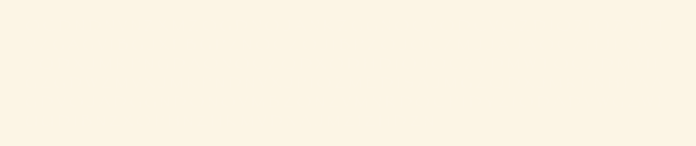

# Wunderdog and the Encrypted Parchment

*Autumn 2022*

(Find our other Wundernuts [here](https://github.com/wunderdogsw/wundernuts))

## Solve the parchment mystery!

A blank [parchment](./parchment.png) was found in the halls of Wunderwarts recently. The parchment is believed to contain secret spells (in English) written with invisible ink. They are probably encrypted. No known spells seem to work to decrypt it. We need your help to solve this mystery!

Can you write some code to translate the hidden and encrypted text back to muggle-readable form?

## Instructions & requirements

* Picture of the parchment can be found [here](./parchment.png).
* Choose any programming language and set of libraries for the task.
* The program needs to be able to handle the image, in order for the invisible ink text to become visible.
* The program must decrypt the text.
* The text must be printed in muggle-readable text format.
* The deadline to submit your solution is Sunday, September 25th. 
* You get an extra point if you find out who might have written this parchment.

## Rules

* Use [submission form] (https://www.wunderdog.fi/wundernut) to submit your contribution.
* The submission must include full source code and instructions to compile and run the program.
* All submissions will be reviewed by a jury consisting of Wunderdog developers.
* The best submissions in code quality metrics terms (https://blog.cloudboost.io/code-quality-metrics-67dc861ac139) will be selected as winners.
